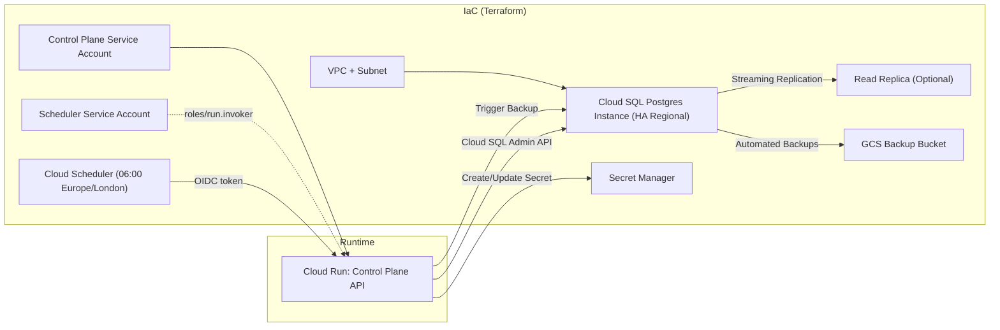
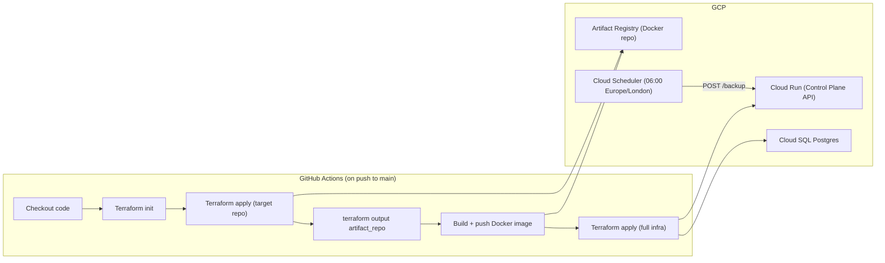
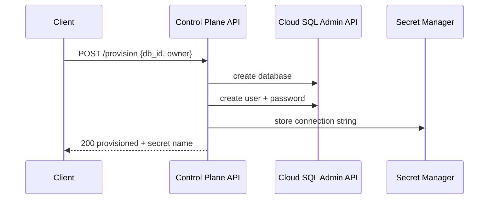
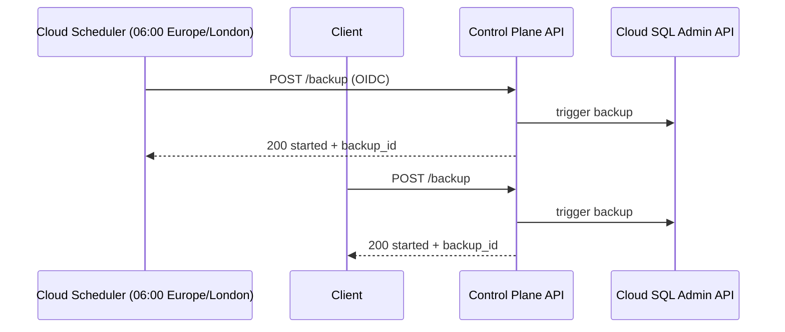
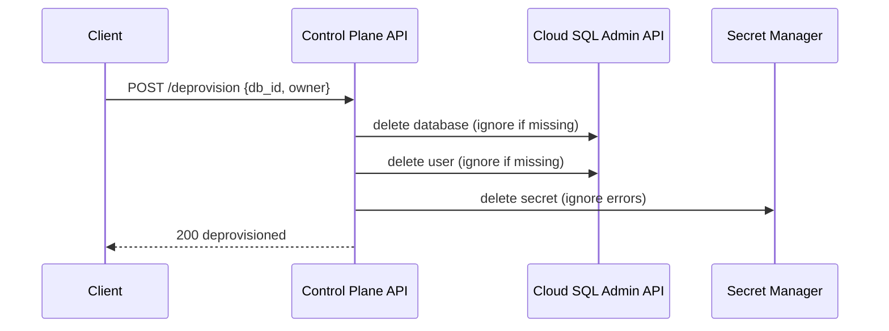
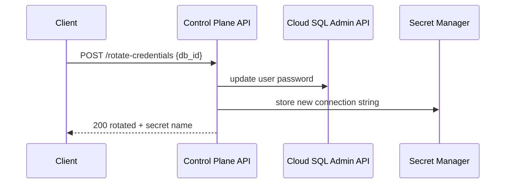
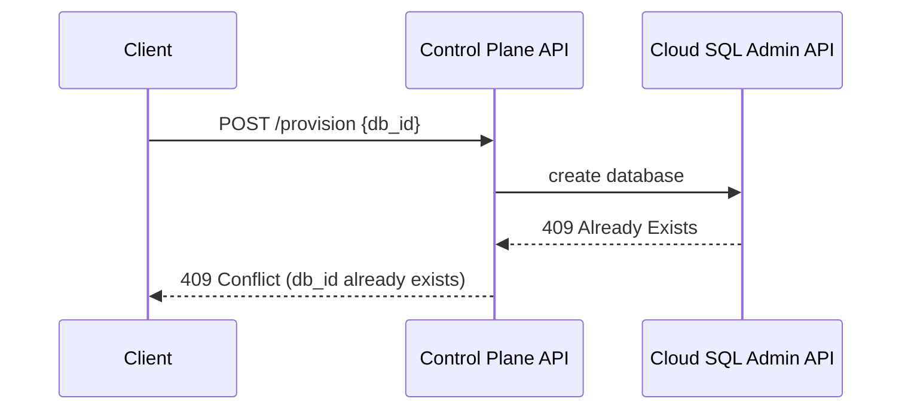
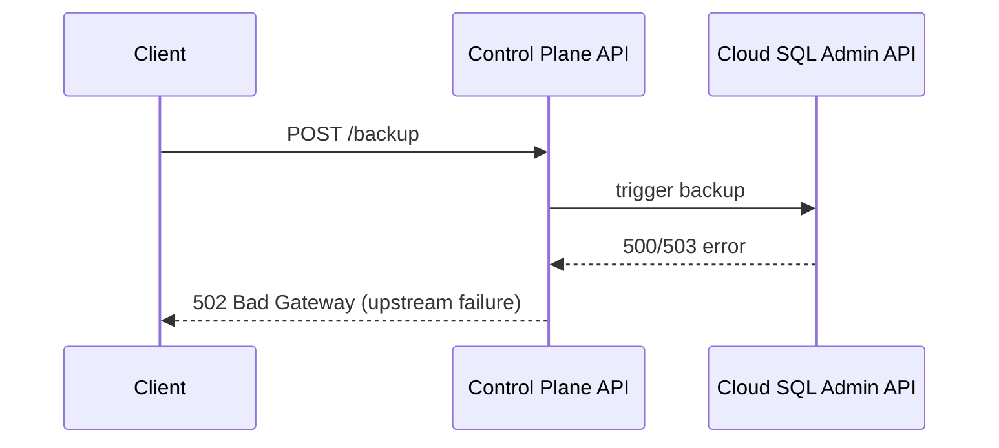

# Diagrams

## Architecture (Infrastructure + Runtime)

## CI/CD Workflow

## Provisioning Flow

## Backup Flow (Scheduled + On-demand)

## Deprovision Flow

## Rotate Credentials Flow

## Error: Provision Conflict

## Error: Backup Upstream Failure

